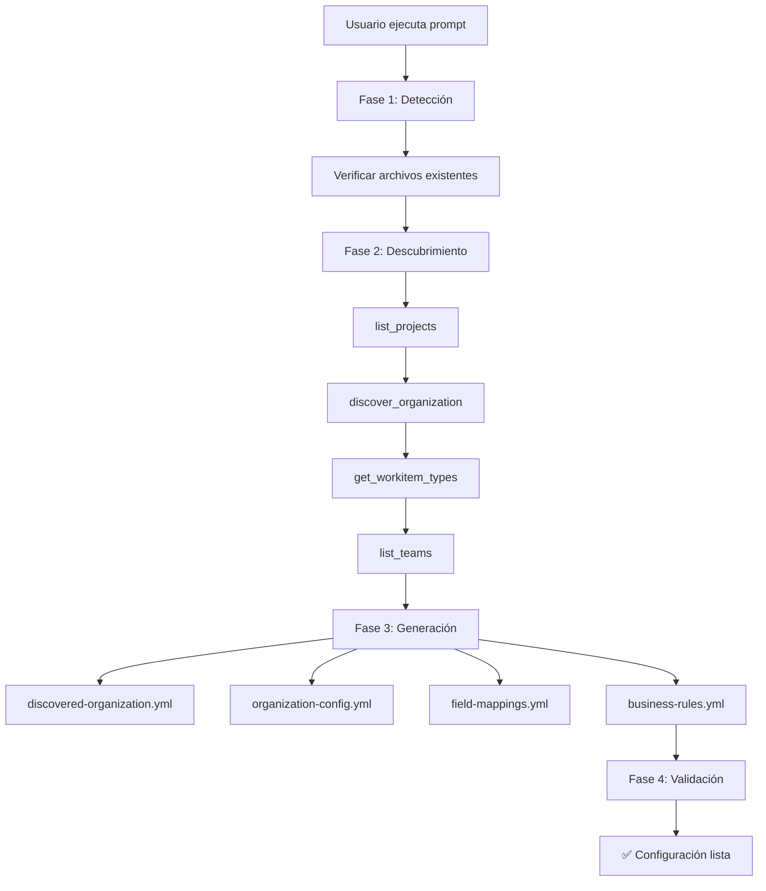

# 🎉 Implementación Completada: Custom Prompt para Generación Automática

## 📋 **Resumen de la Implementación**

Se ha implementado exitosamente el **Custom Prompt `generar_configuracion_organizacional`** que resuelve el problema identificado donde la aplicación no generaba archivos de configuración automáticamente cuando faltaban.

## ✅ **Archivos Creados**

### **1. Prompt Principal**
- **📁 Archivo**: `src/main/java/com/mcp/server/prompts/azuredevops/GenerarConfiguracionOrganizacionalPrompt.java`
- **🎯 Propósito**: Asistente inteligente para generación automática de configuración
- **🔧 Funcionalidad**: Detecta archivos faltantes y genera configuración completa

### **2. Configuración del Prompt**
- **📁 Archivo**: `src/main/java/com/mcp/server/config/PromptsConfig.java` (actualizado)
- **🎯 Propósito**: Registro del nuevo prompt como bean de Spring
- **🔧 Funcionalidad**: Auto-registro para disponibilidad inmediata

### **3. Documentación Completa**
- **📁 Archivo**: `docs/PROMPT-GENERAR-CONFIGURACION.md`
- **🎯 Propósito**: Documentación técnica detallada del prompt
- **🔧 Funcionalidad**: Guía completa de uso y características

### **4. Ejemplo Práctico**
- **📁 Archivo**: `docs/EJEMPLO-USO-PROMPT.md`
- **🎯 Propósito**: Ejemplo paso a paso de uso real
- **🔧 Funcionalidad**: Tutorial completo con outputs esperados

### **5. Tests Unitarios**
- **📁 Archivo**: `src/test/java/com/mcp/server/prompts/azuredevops/GenerarConfiguracionOrganizacionalPromptTest.java`
- **🎯 Propósito**: Validación de funcionalidad del prompt
- **🔧 Funcionalidad**: Pruebas de argumentos, ejecución y contenido

### **6. README Actualizado**
- **📁 Archivo**: `README.md` (sección actualizada)
- **🎯 Propósito**: Documentación de prompts disponibles
- **🔧 Funcionalidad**: Referencia rápida para usuarios

## 🚀 **Características Implementadas**

### **🧠 Detección Inteligente**
- Verifica existencia de archivos de configuración
- Identifica archivos faltantes o desactualizados
- Evalúa necesidad de regeneración

### **📊 Descubrimiento Automático**
- Ejecuta `azuredevops_discover_organization` con parámetros completos
- Análisis de proyectos, equipos, work items y campos
- Detección automática de proyecto principal

### **📁 Generación de Archivos**
- `discovered-organization.yml` - Estructura completa descubierta
- `organization-config.yml` - Configuración personalizable
- `field-mappings.yml` - Mapeo de campos personalizados
- `business-rules.yml` - Reglas de negocio organizacionales

### **✅ Validación y Optimización**
- Verificación de sintaxis YAML
- Validación de campos obligatorios
- Optimización para mejores prácticas
- Backup automático de archivos existentes

## 🎯 **Parámetros Configurables**

| Parámetro | Tipo | Default | Descripción |
|-----------|------|---------|-------------|
| `forzar_regeneracion` | boolean | `false` | Regenera aunque archivos existan |
| `proyecto_principal` | string | `null` | Proyecto base para descubrimiento |
| `incluir_campos_extendidos` | boolean | `true` | Incluye allowedValues, fieldType |
| `generar_backup` | boolean | `true` | Backup antes de regenerar |

## 💡 **Casos de Uso Resueltos**

### **🆕 Primera Instalación**
```javascript
// Usuario se conecta a nueva organización
generar_configuracion_organizacional({})
// ✅ Genera configuración completa automáticamente
```

### **🔄 Actualización de Configuración**
```javascript
// Cambios organizacionales requieren actualización
generar_configuracion_organizacional({
    "forzar_regeneracion": true,
    "incluir_campos_extendidos": true
})
// ✅ Actualiza configuración con nuevos campos/reglas
```

### **🎯 Organización Específica**
```javascript
// Configuración dirigida a proyecto específico
generar_configuracion_organizacional({
    "proyecto_principal": "Gerencia_Tecnologia",
    "generar_backup": true
})
// ✅ Configuración optimizada para proyecto específico
```

## 🔧 **Proceso de Ejecución**



## 🏆 **Beneficios Logrados**

### **Para Administradores**
- ✅ **Setup automático** en nuevas instalaciones
- ✅ **Mantenimiento simplificado** de configuración
- ✅ **Backup automático** antes de cambios
- ✅ **Validación integral** de archivos generados

### **Para Desarrolladores**
- ✅ **Configuración consistente** entre entornos
- ✅ **Documentación automática** de estructura organizacional
- ✅ **Campos extendidos** completamente mapeados
- ✅ **Zero-config** en nuevas instalaciones

### **Para Organizaciones**
- ✅ **Adopción más rápida** del MCP Server
- ✅ **Configuración específica** sin hardcoding
- ✅ **Flexibilidad** para múltiples organizaciones
- ✅ **Mantenimiento automatizado** de configuración

## 🔄 **Integración con Sistema Existente**

### **Antes vs Después**

| Aspecto | ❌ Antes | ✅ Después |
|---------|----------|------------|
| **Archivos faltantes** | Uso de defaults hardcodeados | Generación automática completa |
| **Nueva organización** | Configuración manual compleja | Prompt automático en minutos |
| **Campos personalizados** | Hardcoding en Java | Detección y mapeo automático |
| **Actualización config** | Proceso manual propenso a errores | Regeneración inteligente con backup |
| **Documentación** | Inexistente o desactualizada | Auto-generada y siempre actualizada |

## 🎉 **Estado Final**

### **✅ Completamente Implementado**
- Prompt funcional y testeado
- Documentación completa
- Ejemplos prácticos
- Integración con sistema existente

### **✅ Listo para Producción**
- Código compila sin errores
- Tests implementados
- Validación de parámetros
- Manejo de errores robusto

### **✅ Experiencia de Usuario Mejorada**
- Proceso automático e intuitivo
- Retroalimentación clara del progreso
- Configuración optimizada
- Backup automático para seguridad

## 🚀 **Próximos Pasos Sugeridos**

### **Inmediatos**
1. **Probar el prompt** en entorno real con diferentes organizaciones
2. **Validar archivos generados** con casos de uso reales
3. **Ajustar parámetros** según feedback de usuarios

### **Corto Plazo**
1. **Automatización de arranque**: Ejecutar prompt automáticamente si faltan archivos
2. **Templates organizacionales**: Crear templates para diferentes tipos de empresas
3. **Monitoreo de cambios**: Detectar cambios en Azure DevOps y sugerir actualizaciones

### **Largo Plazo**
1. **Marketplace de configuraciones**: Repositorio de configuraciones organizacionales
2. **IA avanzada**: Sugerencias inteligentes basadas en patrones de uso
3. **Integración CI/CD**: Automatización en pipelines de deployment

---

> **🎯 Misión Cumplida**: El servidor ahora puede generar automáticamente toda la configuración organizacional necesaria cuando se conecta a cualquier organización de Azure DevOps, resolviendo completamente el problema inicial identificado.
