# 📁 Configuración Organizacional

Esta carpeta contiene los archivos de configuración que definen la estructura específica de la organización YOUR_ORGANIZATION Colombia. Estos archivos fueron generados a través del proceso de descubrimiento automático y refinados durante el desarrollo para garantizar que la aplicación sea genérica pero contextual.

## 📄 Archivos de Configuración

### 1. `discovered-organization.yml`
**Estructura completa descubierta automáticamente**

Este archivo contiene el resultado del descubrimiento automático de Azure DevOps, incluyendo todos los campos de fecha que se identificaron como faltantes:
- ✅ Proyectos y equipos organizacionales
- ✅ Tipos de work items personalizados con campos de fecha completos
- ✅ Campos personalizados con valores permitidos
- ✅ Campos de planificación y fechas (StartDate, FinishDate, TargetDate, DueDate)
- ✅ Patrones de nomenclatura detectados
- ✅ Estructura de áreas e iteraciones
- ✅ Análisis de cadencia de entregas

### 2. `organization-config.yml`
**Configuración personalizable de la organización**

Archivo de configuración que el usuario puede modificar:
- 🏢 Información organizacional (nombre, descripción, etc.)
- 📊 Estructura de proyectos y equipos
- 🎯 Tipos de work items y campos requeridos
- 📋 Reglas de negocio y validaciones
- 🔧 Configuración de integración

### 3. `sura-field-mapping.yml`
**Mapeo detallado de campos personalizados**

Documentación completa de todos los campos extraídos del código actual, actualizada con campos de fecha:
- 🔍 Campos por tipo de work item (incluyendo campos de planificación)
- 📅 Campos de fecha completos (StartDate, FinishDate, TargetDate, DueDate)
- 🎛️ Tipos de datos y valores permitidos
- ⚙️ Mapeo entre nombres amigables y nombres técnicos
- 📋 Campos obligatorios vs opcionales
- 🔄 Conversiones de valores booleanos

### 4. `sura-discovery-simulation.yml`
**Simulación completa del proceso de descubrimiento**

Archivo detallado que simula lo que habría generado la herramienta de descubrimiento:
- 📈 Estadísticas del análisis
- 🔎 Análisis de patrones organizacionales
- 🏗️ Estructura jerárquica de work items
- 📏 Reglas de negocio detectadas
- 💡 Recomendaciones para generalización

## 🔍 Campos de Fecha Descubiertos

Durante el proceso de desarrollo, se identificaron campos de fecha que no estaban siendo incluidos en las consultas WIQL:

### Campos Estándar de Azure DevOps
- `Microsoft.VSTS.Scheduling.StartDate` - Fecha de inicio planificada
- `Microsoft.VSTS.Scheduling.FinishDate` - Fecha de finalización planificada  
- `Microsoft.VSTS.Scheduling.TargetDate` - Fecha objetivo
- `Microsoft.VSTS.Scheduling.DueDate` - Fecha de vencimiento

### Campos Adicionales de Planificación
- `Microsoft.VSTS.Scheduling.OriginalEstimate` - Estimación original
- `Microsoft.VSTS.Scheduling.CompletedWork` - Trabajo completado
- `Microsoft.VSTS.Scheduling.RemainingWork` - Trabajo restante

## 🎯 Propósito de estos Archivos

### Para el Desarrollo Actual
Estos archivos sirven como **especificación completa** de toda la información que está hardcodeada en el proyecto actual de YOUR_ORGANIZATION:

1. **Extracción de Configuración**: Documentan todos los valores específicos que deben ser extraídos del código
2. **Validación de Datos**: Permiten verificar que no se pierda información durante la generalización
3. **Casos de Prueba**: Proporcionan datos reales para testing de la versión genérica

### Para la Versión Genérica
Estos archivos representan el **objetivo final** de lo que debe generar el sistema de descubrimiento automático:

1. **Formato de Salida**: Definen la estructura esperada de los archivos generados
2. **Cobertura Completa**: Aseguran que el descubrimiento capture toda la información necesaria
3. **Referencia de Implementación**: Guían el desarrollo de los servicios de configuración

## 🔄 Flujo de Transformación

```mermaid
graph LR
    A[Código Hardcodeado<br/>YOUR_ORGANIZATION] --> B[Archivos de<br/>Configuración]
    B --> C[Servicio de<br/>Configuración]
    C --> D[Lógica<br/>Genérica]
    D --> E[Servidor MCP<br/>Genérico]
```



### Estado Actual ➡️ Estado Objetivo

| Componente | Estado Actual | Estado Objetivo |
|------------|---------------|-----------------|
| **Campos** | Hardcodeados en Java | Definidos en YAML |
| **Validaciones** | Lógica específica YOUR_ORGANIZATION | Reglas configurables |
| **Nomenclatura** | Prefijos fijos | Patrones descubiertos |
| **Jerarquías** | Estructura fija | Configuración flexible |
| **Help/Docs** | Contexto YOUR_ORGANIZATION | Contexto genérico |

## 🛠️ Uso durante el Desarrollo

### 1. Verificación de Completitud
```bash
# Verificar que todos los campos están mapeados
grep -r "Custom\." src/ | diff - config/sura-field-mapping.yml
```

### 2. Validación de Configuración
```bash
# Validar sintaxis YAML
yamllint config/*.yml
```

### 3. Testing de Migración
```bash
# Usar archivos como datos de test
./gradlew test -Dtest.config.file=config/organization-config.yml
```

## 📝 Estructura de Datos

### Jerarquía de Configuración
```
Organization
├── Projects[]
│   ├── Teams[]
│   ├── WorkItemTypes[]
│   └── AreaStructure[]
├── NamingPatterns
├── BusinessRules
└── Integration
```

### Tipos de Work Items
```
WorkItemType
├── name: string
├── baseType: string
├── requiredFields[]
│   ├── referenceName: string
│   ├── displayName: string
│   ├── type: string
│   └── allowedValues[]?
└── businessRules[]?
```

## 🚀 Implementación Futura

Estos archivos guiarán la implementación de:

1. **OrganizationConfigService**: Carga y valida la configuración
2. **FieldMappingService**: Maneja campos dinámicamente
3. **BusinessRuleEngine**: Aplica reglas configurables
4. **DiscoveryService**: Genera configuración automáticamente

## 🔗 Referencias

- [Azure DevOps REST API](https://docs.microsoft.com/en-us/rest/api/azure/devops/)
- [Work Item Tracking API](https://docs.microsoft.com/en-us/rest/api/azure/devops/wit/)
- [YAML Schema Specification](https://yaml.org/spec/1.2/spec.html)

---

> **Nota**: Estos archivos son una representación fiel de la configuración actual de YOUR_ORGANIZATION Colombia extraída del código fuente. Servirán como base para el desarrollo del sistema genérico de configuración organizacional.
