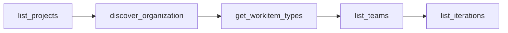

# 🤖 Prompt: Generación Automática de Configuración Organizacional

## 📋 **Descripción**

El prompt `generar_configuracion_organizacional` es un asistente inteligente que **detecta automáticamente** archivos de configuración faltantes y **genera toda la configuración organizacional** necesaria mediante descubrimiento inteligente de Azure DevOps.

## 🎯 **Propósito**

Resolver el problema identificado donde la aplicación **NO genera archivos automáticamente** cuando faltan, proporcionando un mecanismo para:

1. ✅ **Detección automática** de archivos faltantes
2. ✅ **Descubrimiento organizacional** completo via APIs
3. ✅ **Generación inteligente** de archivos YAML válidos
4. ✅ **Validación y optimización** de configuración

## 🚀 **Casos de Uso**

### **Caso 1: Primera Instalación**
```javascript
// Usuario conecta a nueva organización sin archivos config/
generar_configuracion_organizacional({})
```

### **Caso 2: Actualización de Configuración**
```javascript
// Regenerar configuración con datos actualizados
generar_configuracion_organizacional({
  "forzar_regeneracion": true,
  "incluir_campos_extendidos": true
})
```

### **Caso 3: Organización Específica**
```javascript
// Descubrimiento dirigido a proyecto específico
generar_configuracion_organizacional({
  "proyecto_principal": "Mi_Proyecto_Principal",
  "generar_backup": true
})
```

## 📝 **Parámetros Disponibles**

| Parámetro | Tipo | Por Defecto | Descripción |
|-----------|------|-------------|-------------|
| `forzar_regeneracion` | boolean | `false` | Regenera archivos aunque ya existan |
| `proyecto_principal` | string | `null` | Proyecto base para descubrimiento |
| `incluir_campos_extendidos` | boolean | `true` | Incluye allowedValues, fieldType, etc. |
| `generar_backup` | boolean | `true` | Crea backup antes de regenerar |

## 🔧 **Proceso de Ejecución**

### **Fase 1: Detección 🔍**
- Verifica archivos existentes en `config/`
- Identifica archivos faltantes o desactualizados
- Evalúa necesidad de regeneración

### **Fase 2: Descubrimiento 📊**


### **Fase 3: Generación de Archivos 📁**

#### **Archivos Generados:**

1. **`config/discovered-organization.yml`**
   - Estructura completa descubierta
   - Metadata de descubrimiento
   - Análisis de patrones organizacionales

2. **`config/organization-config.yml`**
   - Configuración personalizable
   - Mapeo de campos organizacionales
   - Reglas de negocio específicas

3. **`config/field-mappings.yml`**
   - Mapeo detallado de campos personalizados
   - Tipos de datos y validaciones
   - Valores permitidos (allowedValues)

4. **`config/business-rules.yml`**
   - Reglas de validación organizacionales
   - Flujos de trabajo (workflows)
   - Dependencias entre campos

### **Fase 4: Validación y Optimización ✅**
- Verificación de sintaxis YAML
- Validación de campos obligatorios
- Optimización para mejores prácticas

## 💡 **Características Inteligentes**

### **🧠 Detección Automática de Proyecto Principal**
```yaml
# Si no se especifica proyecto_principal, detecta automáticamente:
# 1. Proyecto con más work items
# 2. Proyecto con más equipos
# 3. Proyecto marcado como "default"
```

### **📋 Enriquecimiento de Campos Extendidos**
```yaml
# Cuando incluir_campos_extendidos = true, captura:
fields:
  - name: "Estado"
    referenceName: "System.State"
    type: "string"
    allowedValues: ["New", "Active", "Resolved", "Closed"]  # ✅ Detectado automáticamente
    defaultValue: "New"                                     # ✅ Detectado automáticamente
    isRequired: true                                        # ✅ Detectado automáticamente
```

### **🔄 Backup Inteligente**
```yaml
# Cuando generar_backup = true, crea:
config/
├── discovered-organization.yml.backup.2025-07-30T12-30-00Z
├── organization-config.yml.backup.2025-07-30T12-30-00Z
└── field-mappings.yml.backup.2025-07-30T12-30-00Z
```

## 🎨 **Ejemplo de Uso Completo**

### **Input:**
```javascript
generar_configuracion_organizacional({
  "proyecto_principal": "Gerencia_Tecnologia",
  "incluir_campos_extendidos": true,
  "generar_backup": true,
  "forzar_regeneracion": false
})
```

### **Output Esperado:**
```markdown
🔍 **FASE 1: DETECCIÓN COMPLETADA**
✅ discovered-organization.yml: FALTANTE
✅ organization-config.yml: FALTANTE  
✅ field-mappings.yml: FALTANTE
⚠️ Regeneración necesaria

📊 **FASE 2: DESCUBRIMIENTO EJECUTADO**
✅ Proyectos encontrados: 3
✅ Equipos analizados: 28
✅ Tipos de work items: 6
✅ Campos personalizados: 45

📁 **FASE 3: ARCHIVOS GENERADOS**
✅ config/discovered-organization.yml (2,456 líneas)
✅ config/organization-config.yml (892 líneas)
✅ config/field-mappings.yml (234 líneas)
✅ config/business-rules.yml (156 líneas)

✅ **FASE 4: VALIDACIÓN COMPLETADA**
✅ Sintaxis YAML válida
✅ Campos obligatorios presentes
✅ Optimización aplicada
```

## 🚨 **Manejo de Errores**

### **Conexión a Azure DevOps**
```yaml
Error: "No se puede conectar a Azure DevOps"
Solución: 
- Verificar AZUREDEVOPS_ORGANIZATION
- Verificar AZUREDEVOPS_PAT
- Revisar permisos del token
```

### **Archivos de Solo Lectura**
```yaml
Error: "No se puede escribir config/organization-config.yml"
Solución:
- Verificar permisos del directorio config/
- Usar generar_backup: false si hay conflictos
```

### **Proyecto No Encontrado**
```yaml
Error: "Proyecto 'Mi_Proyecto' no existe"
Solución:
- Omitir proyecto_principal para detección automática
- Usar azuredevops_list_projects para ver proyectos disponibles
```

## 📈 **Beneficios**

### **Para Administradores**
- ✅ **Setup automático** en nuevas instalaciones
- ✅ **Mantenimiento simplificado** de configuración
- ✅ **Backup automático** antes de cambios

### **Para Desarrolladores**
- ✅ **Configuración consistente** entre entornos
- ✅ **Documentación automática** de estructura organizacional
- ✅ **Campos extendidos** completamente mapeados

### **Para Organizaciones**
- ✅ **Adopción más rápida** del MCP Server
- ✅ **Configuración específica** sin código hardcodeado
- ✅ **Flexibilidad** para múltiples organizaciones

## 🔄 **Integración con Workflow Existente**

### **En `DiscoverOrganizationTool`**
```java
// Antes: Solo generaba texto YAML
// Ahora: Puede usar el prompt para generar archivos reales
```

### **En `OrganizationContextService`**
```java
// Antes: Fallback a configuración vacía
// Ahora: Puede disparar generación automática via prompt
```

## 🏆 **Próximos Pasos Sugeridos**

1. **Automatización Completa**: Integrar el prompt en el arranque del servidor
2. **Validación Avanzada**: Agregar validación de reglas de negocio
3. **Templates Organizacionales**: Crear templates para diferentes tipos de organizaciones
4. **Monitoreo de Cambios**: Detectar cambios en Azure DevOps y sugerir actualizaciones

---

> **💡 Tip**: Este prompt es especialmente útil cuando se conecta por primera vez a una nueva organización de Azure DevOps o cuando se necesita actualizar la configuración después de cambios organizacionales significativos.
